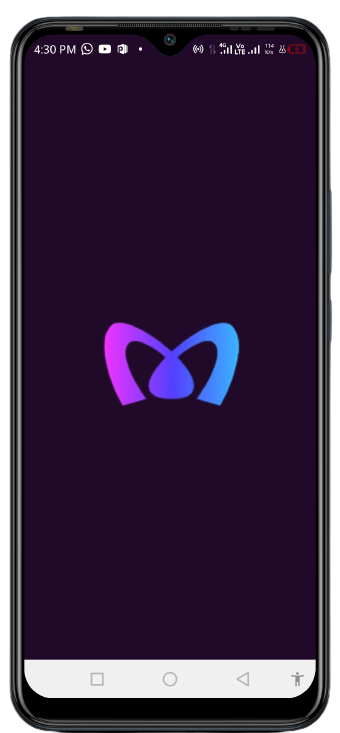
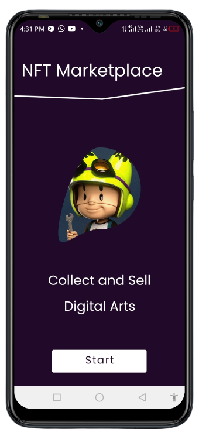
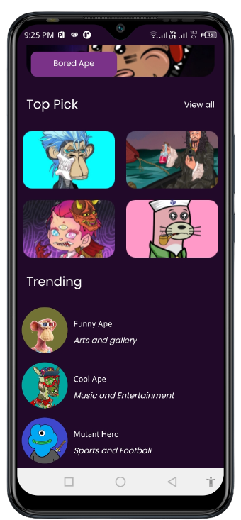

# NFT-App
- Beautiful 😍 multiple view RecyclerView NFT app 😍 with Multiple-View-Holders-in-RecyclerView consuming NFT marketplace API

  

 

## Screenshots 📱

  
  
  
  
  

 

## Concepts
- A single RecyclerView to display MultipleViews with Clean structural design pattern
- Using a single recyclerView with multiple view types or multiple viewholders
- Clean Code — MVVM architecture
- Displaying data from an external api

